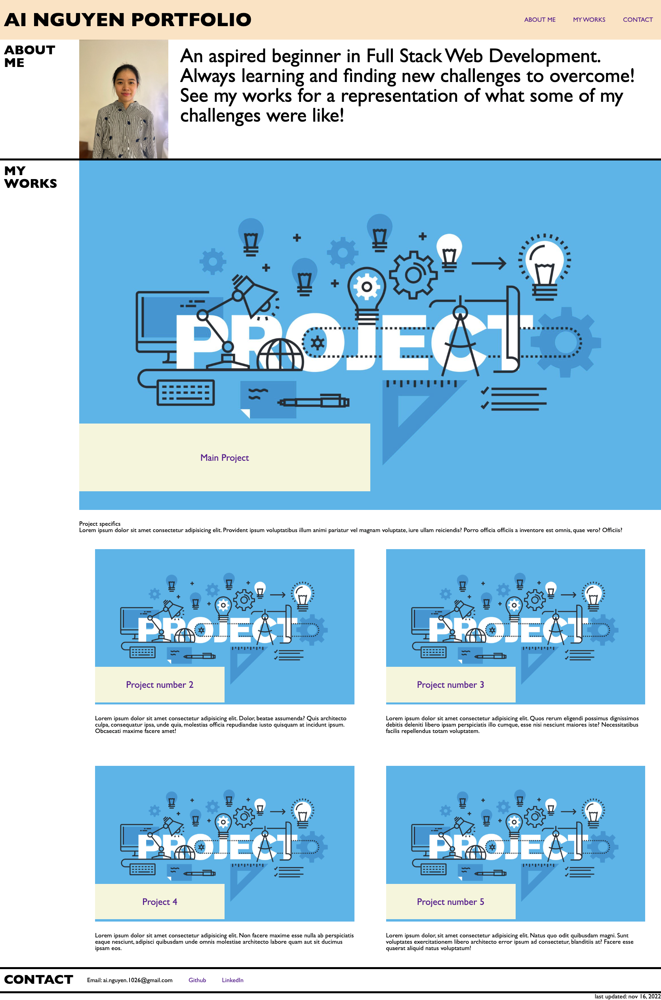
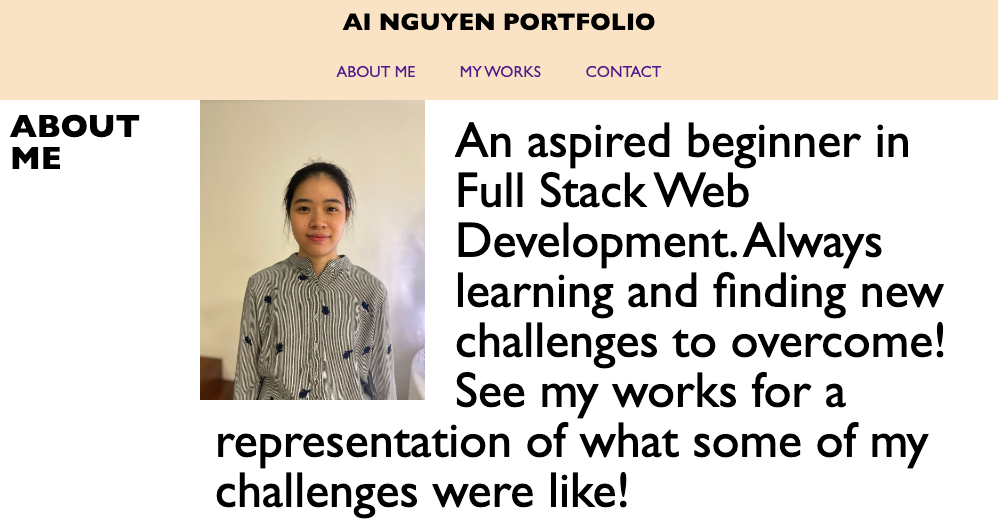
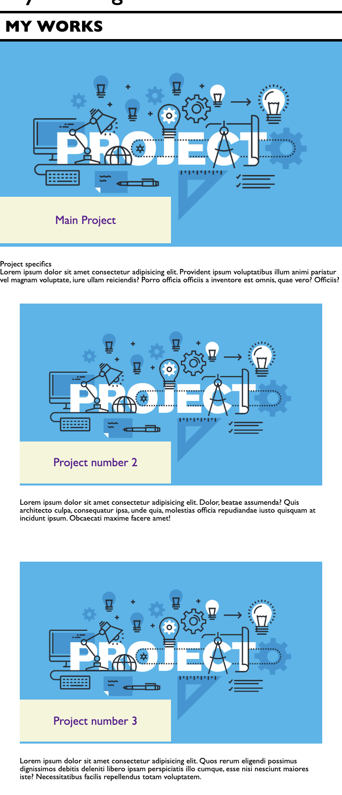

# Bootcamp Module 2 Challenge - Advanced CSS Challenge: Professional Portfolio

## Description

This week, you'll build a portfolio page, which you can add to as the course progresses.

A portfolio of work can showcase your skills and talents to employers looking to fill a part-time or full-time position. An effective portfolio highlights your strongest work as well as the thought processes behind it. Students who have portfolios with deployed web applications (meaning they are live on the web) are typically very successful in their career search after the boot camp. This last point can't be stressed enough: having several deployed projects is a minimum requirement to receive an initial interview at many companies.

With these points in mind, in this Challenge you'll set yourself up for future success by applying the core skills you've recently learned: flexbox, media queries, and CSS variables. You'll get to practice your new skills while creating something that you'll use during your job search. It's a win-win that you'll likely be grateful for in the future!

## Usage

Link to deployed application: https://vuivui169.github.io/portfolio-module-challenge-2-ai-nguyen/

The deployed webpage should appear as follows

If page width becomes 1035px or smaller, the header will re-arrange elements

If page width becomes 800px or smaller, each project will display in separate rows

## License

Please refer to the LICENSE in the repo.

## Other notes

submitted late by 12 days.

## Feedback

Very good job! The site has a good design and is mobile responsive. The navbar links are all working. The site includes your name and your picture. The section showcasing your passed projects has working links. The portfolio showcases all of the required sections for the assignment. * Clicking on a featured application doesn't open that deployed application (at least one application, in case they are using placeholders). The Readme is very descriptive with a link to live application. Keep up the good work. [95/100]